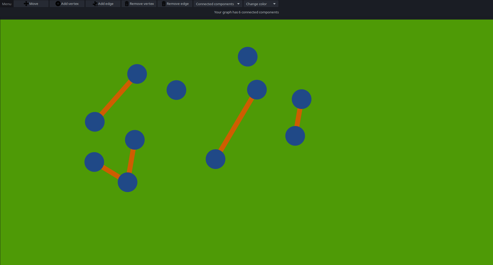
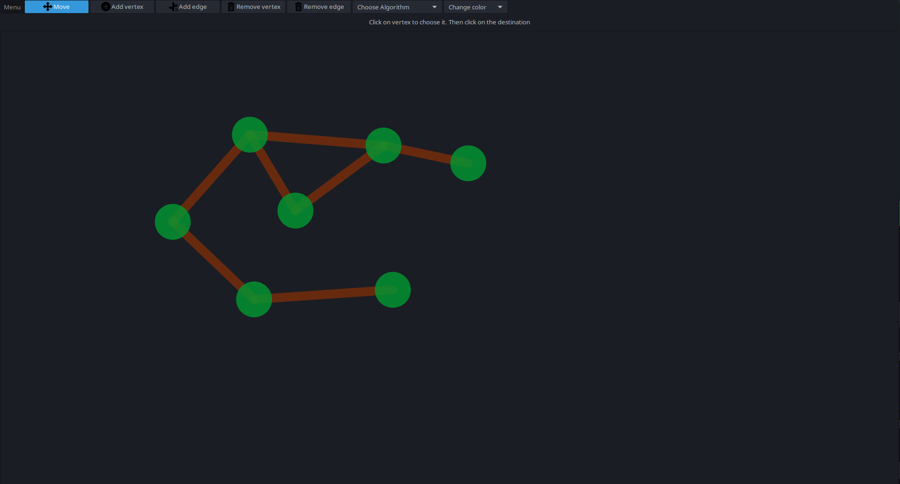

# GraphEditor
## Project in C++ by Jakub Kaczmarek

## Compilation:

Project requires Gtkmm-3.24
To compile use
```
make
```

## Gtkmm instalation

https://www.gtkmm.org/en/download.html

## Description

Program can be used to visualize and edit undirected graphs. User can create and edit them using available tools like "Add vertex", "Add edge", "Remove vertex", "Remove edge" or "Move". One can also export/import graphs from files. GraphEditor supports undirected graph in DIMACS without edge weights nor colors. Program can also visualize algorithms like: BFS, DFS and calculate the number of connected components. User can also set the color of vertices, edges and background.

"Icons made by Pixel perfect from www.flaticon.com"
"Icons made by Freepik from www.flaticon.com"

Example graphs are mostly downloaded from http://pallini.di.uniroma1.it/Graphs.html.

## About DIMACS format
An input file contains all the information about an undirected graph. 

In this format, nodes are numbered from 1 up to n edges in the graph. 

Files are assumed to be well-formed and internally consistent: node identifier values are valid, nodes are defined uniquely, exactly m edges are defined, and so forth. 


Comments. Comment lines give human-readable information about the file and are ignored by programs. Comment lines can appear anywhere in the file. Each comment line begins with a lower-case character c.

```
c this is an example of a comment line.
```

Problem line. There is one problem line per input file. The problem line must appear before any node or arc descriptor lines. The problem line has the following format. 

```
p FORMAT NODES EDGES
```

The lower-case character p signifies that this is the problem line. The FORMAT field should contain the word "edge". The NODES field contains an integer value specifying n, the number of nodes in the graph. The EDGES field contains an integer value specifying m, the number of edges in the graph. 


Edge Descriptors. There is one edge descriptor line for each edge the graph, each with the following format. Each edge (u,v) appears exactly once in the input file and is not repeated as (u,v). 

```
e u v
```

The lower-case character e signifies that this is an edge descriptor line. For an edge (u,v) the fields u and v specify its endpoints. 

## Screenshots
	
	